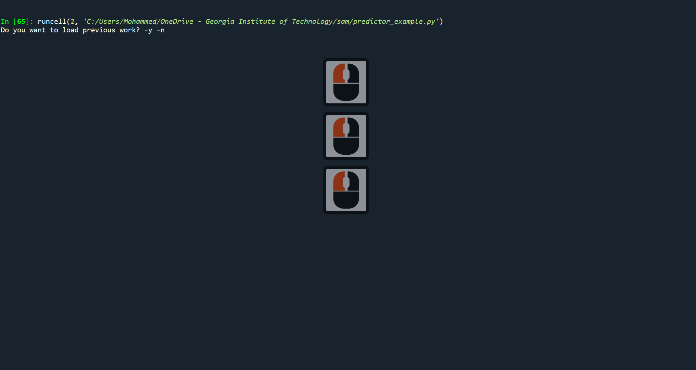

# SAM-for-Seismic-
SAM-based segmentation tool for Seismic data. We are interested in segmenting the Salt-dome region using SAM. In this code, the user will be able to prompt green points and red points, which represent inclusion and disclusion points of the ROI, respectively. However, this time we are aiming to achieve an mIOU of 0.9. This is easily achievable due to the new added features.

# Instructions: 
1. Download SAM weights using :  
`!wget -q https://dl.fbaipublicfiles.com/segment_anything/sam_vit_h_4b8939.pth  `   
**or from this [direct-link](https://dl.fbaipublicfiles.com/segment_anything/sam_vit_h_4b8939.pth)**
and place it in your repository folder.  
2. Download the samples from [here](https://gtvault-my.sharepoint.com/:u:/g/personal/malotaibi44_gatech_edu/EZXzpgizXyxKhB7thUknI1oBxKdc58WjIhYA0NipyhNKog?e=0hnU3L) and place it in your repository

3. run the code using non-notebook IDE (e.g. spyder,Pycharm, etc...)
4. The code loads SAM weights and asks if you have previous work that you want to continue. If this is your first time, then type n. 
otherwise, if this is not your first time and you want to continue from where you stopped, then type y.
5. In both options, you will write your name, if this is your first time, a new folder by the name you typed will be created. This folder will save metadata in an Excel sheet (also by your name), a txt file where it shows how much time you spend labeling in total, and masks folder where it stores all your segmentations.  
If this is not your first time, then type the same name you typed in your first time, the code will load your next unlabeled sample so you can continue from where you stopped.
6. As you can see in the GIF, a window of three figures will show up. from left to right: Seismic sample, ground-truth of the salt dome region (ROI area), and SAM segmented area based on your promoted points along with the IOU. This figure will be active if you select at least one green point and at least one red point. every time you add/remove a point a new segmentation will be generated and a new IOU based on the new segmentation, so you can add/remove points according to the IOU. 

7. We have two modes: Green (activated by pressing the letter g on your keyboard), and Red (activated by pressing the letter r on your keyboard). This time you can not just add, but also remove points. By using a left-click on your mouse you can add a new point, and using a right-click on your keyboard you can remove an existing point. The type of point (green/red) you will be added/removed depends on which mode you are currently in (Green or Red). Moreover, if you want to remove all your points and start all over again, then you can press the space tab on your keyboard  
**There is a little bug that you don't need to worry about, on the far-right figure, the points that were removed will still be visible, however, what will be inputted to sam, is what you see in the left and middle figures**
8.  Once you feel satisfied with your results you can close the window. But remember, we are interested in achieving an mIOU of 0.9, so try your best to achieve at least an IOU of 0.9. Most of the time, this is easily achievable. Here is some tips how can u achieve better score: 
&nbsp;   **a.** Try removing rather than adding more points, sometimes adding more points does not help. 
&nbsp;   **b.** If you feel stuck, try removing all points using space tap and start over again 
&nbsp;   **c.** be aware that the black edges of the salt dome are included in the ROI, so try to make SAM include these areas. This will increase your score.  
9.  After closing the window you will be asked if you still want to continue or not. if not you can press n and the code will be terminated. Otherwise, you can press y to proceed to the next sample.
10.  Once you finish all the 150 samples ( we expect to take 3 hours maximum), send us the folder that has your name.
